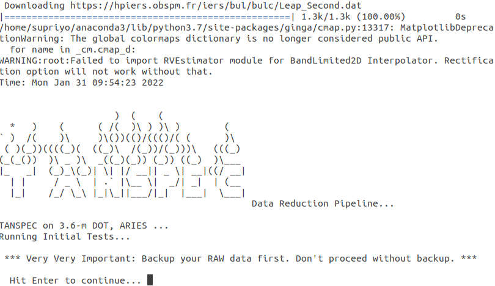

[Home](Pipeline_Documentation.md)

[Pipeline In a Nutshell](Pipeline_in_a_nutshell.md)

[Installation](Installation.md)

[Getting Started](Getting_started.md)

[Tasks](Tasks.md)

[Advantages and Limitations of the pipeline](adv_disadv.md)

[Appendix](Appendix.md)

# Getting Started

## Set up config file

The config file should be saved in the directory where the sub-directory of your data is present. The variables that should give to config file are listed.

-   'INSTRUMENT=': Since you are working with TANSPEC, give TANSPEC here.
-   'TODO=': You can select the mode of extraction.
    -   'TODO= P': for Photometry.(Currently not available)
    -   'TODO= SL': To extract LR mode spectra.
    -   'TODO= SX': To extract XD mode spectra.
-   'OUTPUTDIR=': Name of the output directory.
-   'TEXTEDITOR=': Give the name of text editor you want to use(eg:emacs, vi, vim, gedit etc). In task 1 and 2, The text editor window will open up and you can make required changes in that.
-   'NIGHTLOGFILE=': Name of the log file for each night. This will be created in Task 0. (eg: ObsLogofImages.txt)
-   'COMBINEIMGS= ': Number of images you want to combine. (Keep it as N)
-   'REMOVE\\COSMIC=': Set Y if you want to do cosmic ray reduction.
-   'HEADER KEY WORDS': Pipeline uses the certain keywords while selecting files. Make no change here.
-   'DISPAXIS= 1': Keep it 1 for TANSPEC.
-   'REMOVE\\CONTINUUM\\GRAD= ': Remove the illumination pattern in the continuum lamp spectrum. Keep 'Y' always.
-   'CONTGRADFILTSIZE=': Specify the median filter box size X Y below.(eg: 25 51)
-   'Selected\\Window\\Dither\\Find=': To find dithered pair. (eg: 380 460)
-   'ApertureWindow=': Aperture width for extracting spectrum. (Recommended -9 9 for LR and -11 11 for XD)
-   'BkgWindows=': Background sample regions for extraction of spectrum as well as background estimation(Recommented -25 -12 12 25 for LR and -20 -13 13 20 for XD)
-   'SPECCONFIGFILE=': Config file for SpectrumExtractor. Keep it blank.
-   'WLFitFunc=': Function to fit Wavelength Solution. (Recommented l4)
-   'SCOMBINE=': Give 'YES' if you want to average wavelength calibrated spectra.

## Run the pipeline

Enter the following command in terminal where you saved your data and config file.

    pyspec TANSPECscript.config

Then the following commands will appear in terminal.

You will see the same whenever you give this command.

When this command is given, a sub-directory will be created in the current directory, with the name you set in the config file. All the results will be saved in that directory.

Next, just hit enter. If you want to continue, press 'y'. Now, a list will appear. You can select the task you want to run here. You can either run each task separately, or can run more than one or all tasks together. Just need to give the task numbers with space for that.

