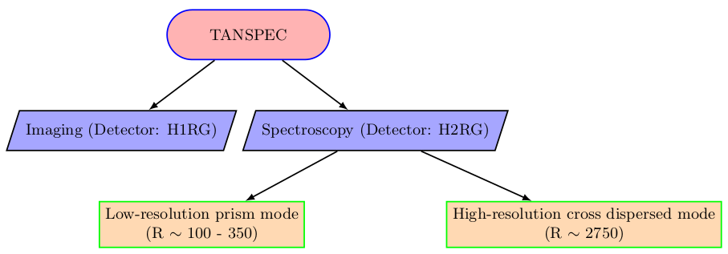

[Home](Pipeline_Documentation.html)

[Pipeline In a Nutshell](Pipeline_in_a_nutshell.html)

[Installation](Installation.html)

[Getting Started](Getting_started.html)

[Tasks](Tasks.html)

[Advantages and Limitations of the pipeline](adv_disadv.html)

[Appendix](Appendix.html)

# Home

The TIFR-ARIES Near Infrared Spectrometer (TANSPEC) is a unique instrument mounted on India’s largest ground-based telescope, 3.6-m Devasthal Optical Telescope (DOT) at Nainital, India on April 02, 2019 having simultaneous wavelength coverage from 0.55 to 2.5 $&mu;$m with a resolving power, R$\sim$ 2700 in the cross dispersed mode (XD-mode) and R$\sim$ 100 &#x2013; 350 in the low-resolution prism mode (LR-mode). In addition, it has an independent imaging camera consisting of several broadband and narrowband filters with a pixel scale of 0.25 arcsec/pixel (see Fig. [10](#orga1cdac1)). The TANSPEC uses two Teledyne HAWAII (HgCdTe Astronomical Wide Area Infrared Imager) detectors (H1RG: 1024 $\times$ 1024 pixels for imaging as well as slit-viewing and H2RG: 2048 $\times$ 2048 pixels for spectroscopy). [Click here for additional details on the TANSPEC.](https://www.aries.res.in/sites/default/files/files/3.6-DOT/Tanspec-Specification-Manual.pdf)

.")

As the TANSPEC is a complex instrument, a dedicated automated pipeline is at the need for consistent data reduction over the nights and for reducing the data reduction time. The TANSPEC provides three modes of observations, XD-mode, LR-mode and imaging-mode. Among them, the XD-mode is used at most by its users. The data of standard spectroscopic observations in XD-mode consist of object frames (science star) with corresponding calibration lamps such as continuum lamps and arc lamps (Ar and Ne) for the flat correction and the wavelength calibration, respectively. The observed frames in the TANSPEC XD-mode, as an example, are shown in Fig.[11](#org218ecb3). As presented in Fig.[11](#org218ecb3), the images in the XD-mode consist of multiple orders (10 orders) in 2048 $\times$ 2048 pixels detector to cover the full-wavelength regime of the TANSPEC (i.e. from 0.5 to 2.5 \mum). Thus, the data reduction of the XD-mode is a bit more complex and time-consuming than the other two modes (imaging and LR-mode). A consistent data reduction for all 10 orders is also another requirement for the XD-mode. The following sections illustrate the data reduction methods for the TANSPEC XD-mode through the pipeline. 

