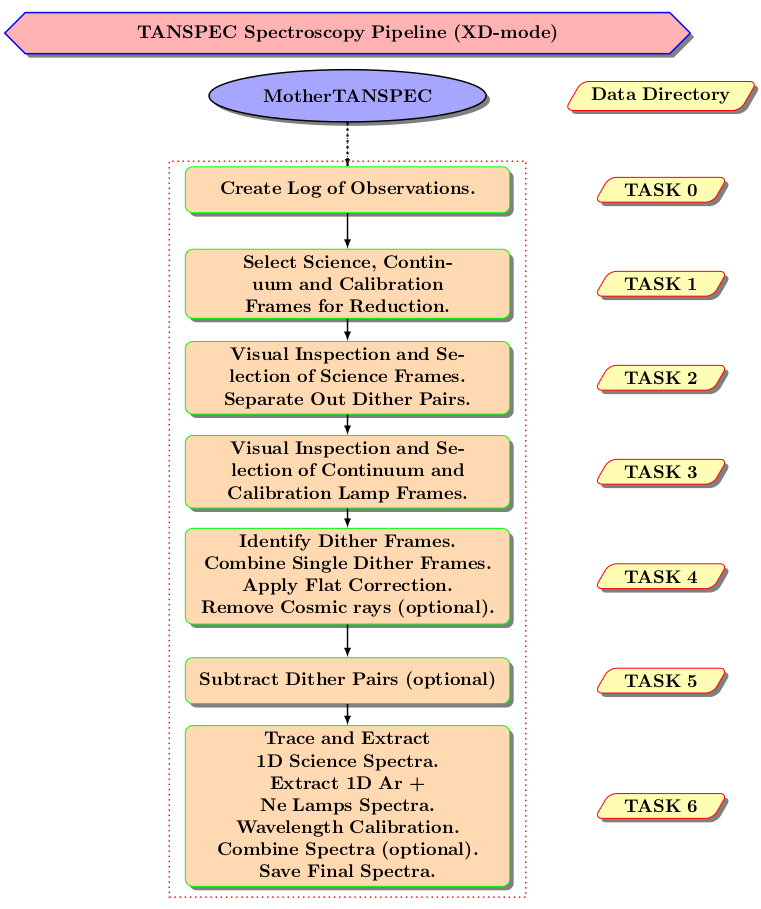

[Home](Pipeline_Documentation.html)

[Pipeline In a Nutshell](Pipeline_in_a_nutshell.html)

[Installation](Installation.html)

[Getting Started](Getting_started.html)

[Tasks](Tasks.html)

[Advantages and Limitations of the pipeline](adv_disadv.html)

[Appendix](Appendix.html)

# Pipeline In a Nutshell

The pipeline comprises a set of Python procedures. It is solely based on Python and does not use the well-known astronomical data reduction software, IRAF at all. Instead of full-scale automation, the pipeline is made semi-automated with minimal human intervention for the quality assurance of the reduced data. The interface of the pipeline has been designed a lot alike the TIRSPEC pipeline so the users of it can operate the TANSPEC pipeline with ease.

The pipeline uses two configuration files to control the data reduction. The data reduction starts with creating a \`log file’ of all the fits files of a given data directory by the user. The pipeline automatically generates the file based on the header information. In the following steps, the pipeline identifies the object, continuum and calibration lamps (Ar and Ne) images from the \`log file’ based on the user input, displays all these frames for visual inspection and selects good images for the reduction. The pipeline then applies the flat correction, removes cosmic rays, combines all the frames at the same dither and substracts dither pair based on the user inputs. The final task is the extraction of 1D spectra and performing the wavelength calibration for all orders. Each task of the pipeline can be run independently or simultaneously. The metadata for the pipeline is passed on from one task to the next task via human-readable text files. This helps the users to control the flow of the pipeline more. The outline of these steps for the XD-mode data reduction is displayed in Fig.[10](#orgaee96f5). One of the key aspects of the pipeline is that even the star is observed in one position of the slit (which is not followed commonly for Near-Infrared observations), it can extract the spectrum efficiently.  

The pipeline creates a \`log file’ of all the fits files for the given data directory by the user in the first place. The pipeline automatically generates the file based on the header information. In the following steps, the pipeline identifies the object and calibration lamps (continuum, Ar and Ne) images for the reduction, displays all these frames for visual inspection, applies the flat correction, removes cosmic rays, combines all the frames of same dither, substracts dither pair based on the user inputs. The final step is the extraction of wavelength calibrated 1D spectra for all orders. Each step of the pipeline can be run independently or simultaneously. The meta data for the pipeline is passed on from one step to the next step via human readable text files. This helps the users to control the flow of the pipeline more. The outline of these steps for the XD-mode data reduction is displayed in Fig.[10](#orgaee96f5).

