[Home](Pipeline_Documentation.html)

[Pipeline In a Nutshell](Pipeline_in_a_nutshell.html)

[Installation](Installation.html)

[Getting Started](Getting_started.html)

[Tasks](Tasks.html)

[Advantages and Limitations of the pipeline](adv_disadv.html)

[Appendix](Appendix.html)

# Tasks

After entering 'pyspec TANSPECscript.config', you will see the opening commands. Press enter, and then 'y'. Then a list of tasks will appear(fig [10](#org9a4f9f6)). You can give each task one at a time or more than one together by putting space between them(eg:1 2 3).

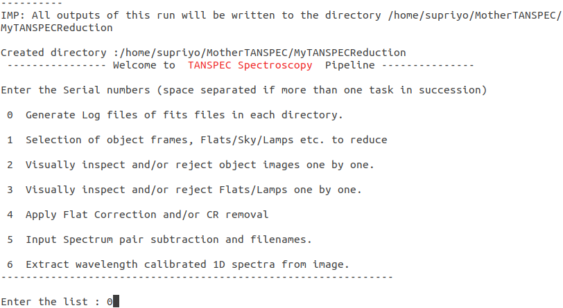

## Task 0

This task is to create the a list of files in the directory where you saved the data. It will ask the name of data directory, just enter the name there. Then, a txt file will be created in the directory. The txt file will have the list of all the fits files in that directory, with the informations took from the fits header. Informations such as object, exposure time, filter, grating, calmirr, gain, slit, argon, neon, cont1, cont2, date, some readings on instrument and telescope, Instrument name and FNUM. A serial number also will be added with it at the end.

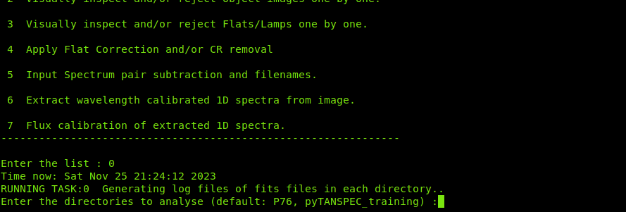
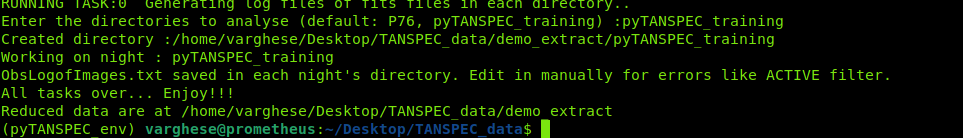

## Task 1

You can select the science files, and flats and lamps corresponding to each science frame using regular expression of file name and the range of FNUM. After selecting the night and press enter, the instruction to give the regular expression of the science frames will appear. There you can enter the regular expression.

eg: .\*hd37725.\*

After typing this and pressing enter, the portion to enter the regular expression of continuum will appear. Here you can enter the regular expression of continuum and the range of FNUM.

eg: .\*continuum2.\* 200 203

After this step, you can enter the regular expression and FNUM of argon and neon frames in the same way. Figure [18](#org2c17074) shows the terminal after filling the regular expressions in each step.

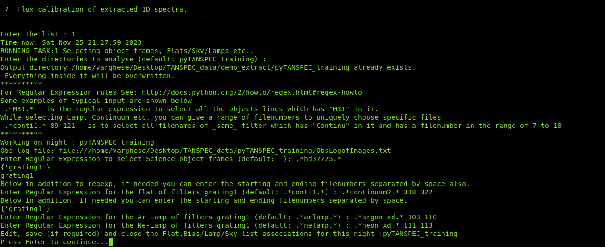

Afterwards the pipeline asks the user to hit 'Enter' to move forward, and it ipens txt files where object and its corresponding continuum, Argon and neon frames are saved as shown in figures [20](#org37c7c2b) and [21](#orgdf4d750). Thus, the user can check if the pipeline selected desired frames. Task 1 will over with this.

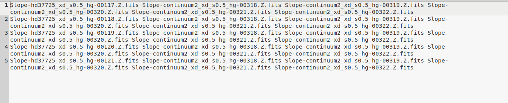

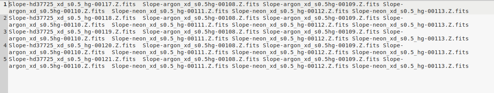

## Task 2

This tasks asks to enter the data directory for reduction and shows the defause name. User just need to hit 'Enter'. Now the pipeline displays all the object frames one by one for eyeballing and users need to close the displaying window for getting the opetion for accaptence by typing 'aa' and hit 'Enter' or rejection by typing 'r' and hit 'Enter' the images. In addition, put 'OBJECT', 'GRATING', 'SLOT', 'ITIMEREQ' and 'DATE\OBS' on view as a 'Title' of the image to cross-check the object frames again. It is to note that if users discrad all object frames, the pipeline stops the reduction procedure. At the end of 'TASK 2', the pipeline shows the location of files that lists selected images, and users need to hit 'Enter' to get going.
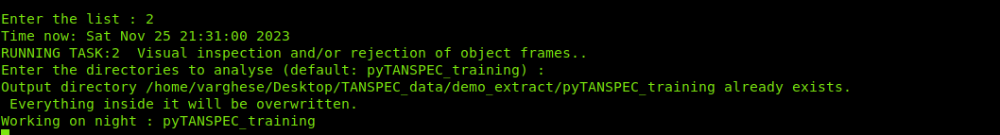
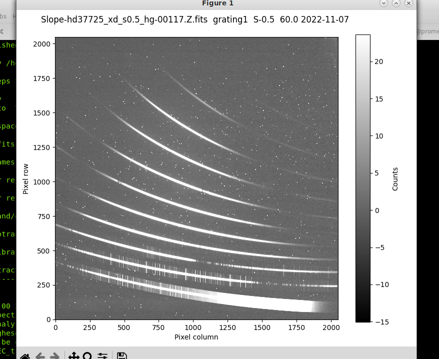
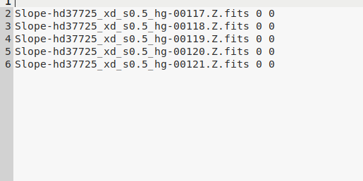

## Task 3

\`TASK 3' is similar to \`TASK 2', but it is for continuum and calibration lamp frames. \`TASK 3' starts with confirmation of the data directory from the users (see Fig. [24](#org46be690)).  Now, all continuum and calibration lamps images are displayed for visual inspection and users get an option of accepting or rejecting the images after closing the pop-up window. Fig [25](#orgbd852bd) shows a 2d image of continuum flats. All the files given in previous step will be shown like this. User can accept or reject by entering 'aa' or 'r'. Fig. [26](#org31029db) shows the 2D image of Argon lamp spectra. User can accept or reject the frames as same as in previous step. Same can be done for Neon also. It is important to note that if users discard all continuum images or Ar lamp image or Ne lamp image, the pipeline fails to complete the reduction procedure. Therefore, Ar and Ne lamps images can not be discarded. However, displaying these images are important for inspection. If wrong Ar and Ne files were selected, users will have to rerun the pipeline with correct frames. After the successful selection of frames, \`TASK 3' is completed.

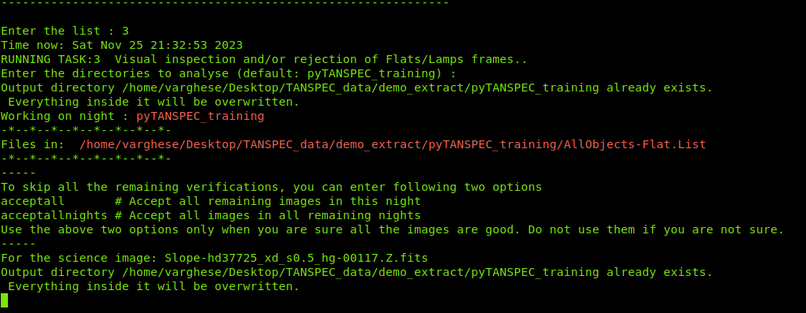

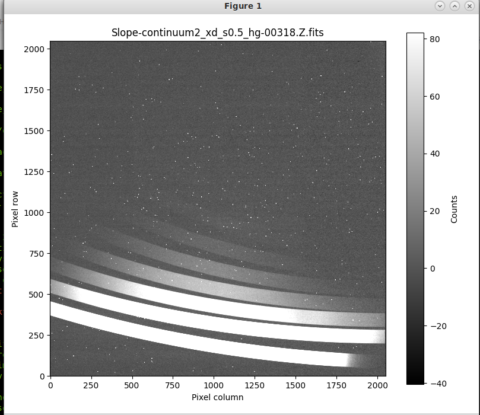

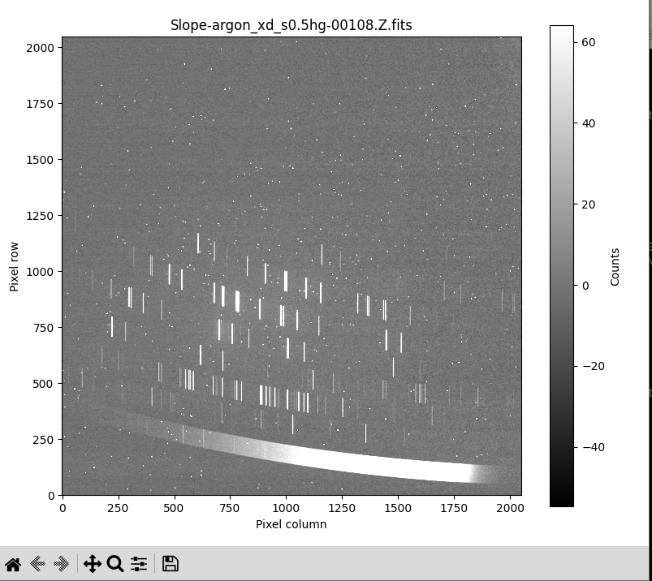

## Task 4

In this task, user do not have to enter any input. The pipeline is doing the medine combine, flat correction and cosmic ray removal of object frames. The pipeline does these operations twise as dithering was done during observations. If user is not using dithering, it will be done only once. 
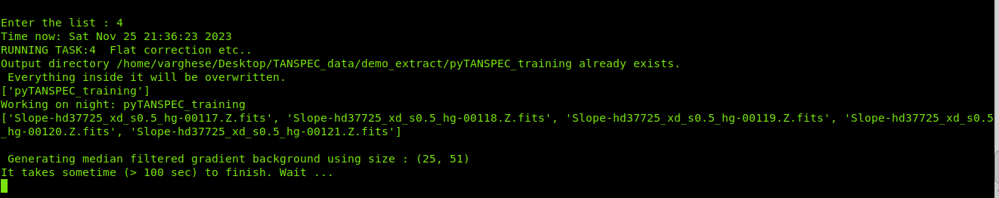

## Task 5

In this task, the user have to enter the prefix for reduced 1d spectra. Here, 'hd37725xds0.5 is' typed and hit 'Enter' to get going. The pipeline then displays median combined, flat corrected and cosmic rays removed image as shown in Fig. [30](#org0f9b1cc). User need to close the pipped-up display window to continue. Thereupon users get an option for eithter dither pair substraction or no-substraction. Here, we are not doing the substraction of image. If user want to do the subtraction, enter AB or BA. Otherwise, just type A. After this, the files are saved in new names.

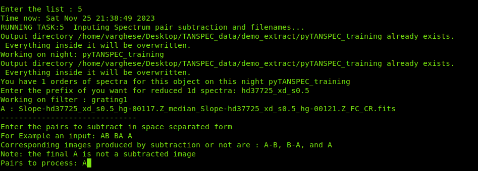

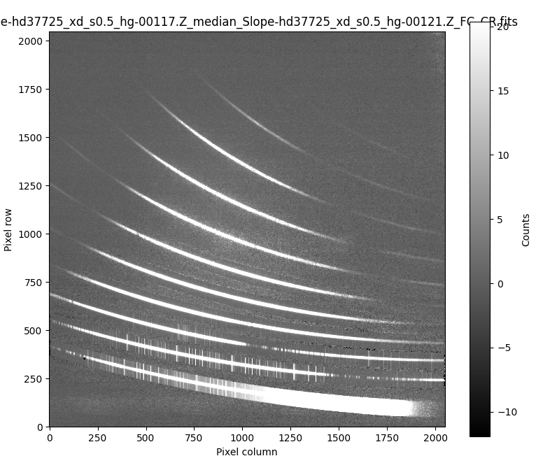

## Task 6

In this task, users need not enter any input during the pipeline run. It first estimates the avgerage shift in XD direction to match the spectrum image to the reference image, and returns coefficients of average fitted shift. the spectra of all apertured and their associated background from both sides of the spectrum trace are then extracted simultaneously. Using the estimated XD shift as mentioned above, the spectra of Argon and neon lamps are extracted. The pipeline does the wavelength calibration and saves the wavelength calibrated spectra in \*.wlc.fits file. Further, the background subtracted wavelength calibrated spectra can be found in \\\*final.fits. 
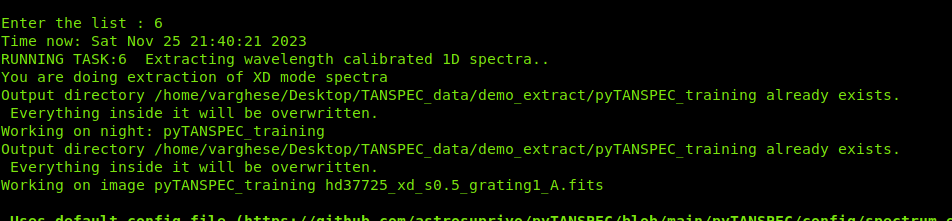
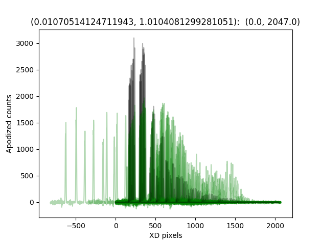
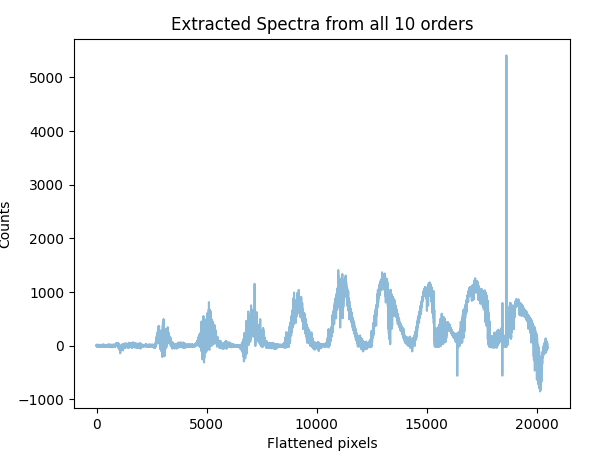

## Task 7

In this task also user do not have to enter any input. The name of file saved in the previous task will be saved in a text file. This task will read the filename from that text file. Then load the spectra file as an array, and divide with the response curve saved with the pipeline. The final array will be saved in the format \*.flc.fits. If user want to do the flux calibration of any other file, just write the file name in the text file and run task 7. That's it.
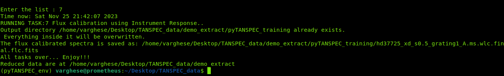

